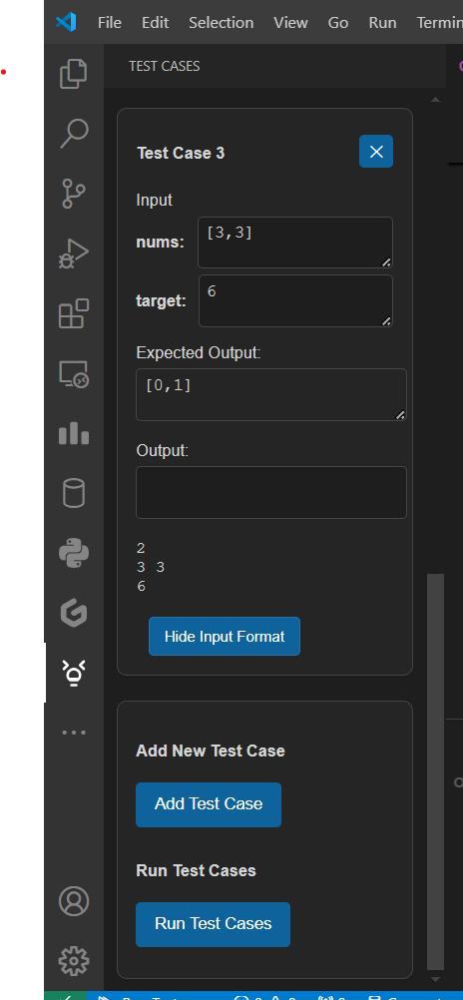

# CPH for LeetCode

`CPH for LeetCode` is a Visual Studio Code extension designed to enhance your LeetCode experience by allowing you to fetch problems locally, solve them, and test your solutions with ease.

## Features

1. **Fetch Multiple Language Snippets:**
   - Supports all 18 programming languages available on LeetCode.
   - Code in any language (requires the necessary language to be installed on your PC).

2. **Commands for Ease of Use:**
   - `CPH: Fetch Problem`
   - `CPH: Run Test Cases`

3. **Default Test Cases:**
   - Fetch all default test cases provided by LeetCode.

4. **Add/Delete Test Cases:**
   - Add or delete custom test cases with proper handling of input formats.

5. **Support for Complex Problems:**
   - Solve multiple input questions and even those involving complex data structures.

6. **Global Test Case Storage:**
   - Test cases persist across different sessions.

7. **SideBar with case handling:**
   - It have a sidebar which contains all the test cases with test case management as well.

8. **Two Ways to Run Solutions:**
   - Run solutions via the WebView or directly from the Command Palette.

9. **Separate Input/Output Files:**
    - Creates individual input and output files for each test case.

10. **Editable Test Cases:**
    - Edit already created test cases.

11. **Input Format Assistance:**
    - Guides you on how to provide input as it would be in the standard input stream at runtime.

### Supported Languages

| Language      | File Extension |
|---------------|----------------|
| C++           | `.cpp`         |
| Java          | `.java`        |
| Python/Python3| `.py`          |
| C             | `.c`           |
| C#            | `.cs`          |
| JavaScript    | `.js`          |
| TypeScript    | `.ts`          |
| PHP           | `.php`         |
| Swift         | `.swift`       |
| Kotlin        | `.kt`          |
| Dart          | `.dart`        |
| Go            | `.go`          |
| Ruby          | `.rb`          |
| Scala         | `.scala`       |
| Rust          | `.rs`          |
| Racket        | `.rkt`         |
| Erlang        | `.erl`         |
| Elixir        | `.ex`          |
| Other         | `.txt`         |

## How to Use

1. Open the Command Palette (`Ctrl+Shift+P` or `Cmd+Shift+P` on macOS).
2. Select `CPH: Fetch Problem`.

   
3. Provide the LeetCode problem URL.

   
4. Choose your preferred programming language from the dropdown menu.
   
   
5. Get the code snippet for the selected language.
   
   
6. Write your solution.
   
   
7. Can add/delete the test cases as needed from the sidebar and see inout format.
   
   
8. Test your code in two ways:
   - From the WebView.
   - From the Command Palette.

   
9. View the output in the "Output" field and match it with expected output field.
    
    

10. Files created in test_inputs and test_output
    
    

## Requirements

- Install the necessary compilers/interpreters for the selected language.
- Internet connection is required to fetch problems and test cases from LeetCode.

## Known Issues

- Users must manually enter the input and output flow for test cases.
- That is according to the input format given, user have to write the input and output code
- For complex data structure, they are usually defined in the problem and commented, you can uncomment it and then continue with the solution.

## Release Notes

### 1.0.0
- Initial release of `CPH for LeetCode`.
- Supports fetching problems and running test cases across 18 programming languages.

---

For feedback, suggestions, or reporting issues, feel free to raise them on the [GitHub Repository](https://github.com/your-repo-url)!

**Enjoy coding with CPH for LeetCode!**
